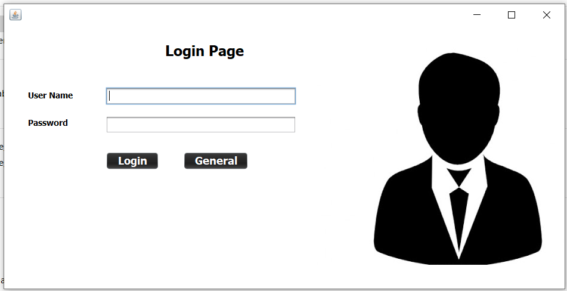
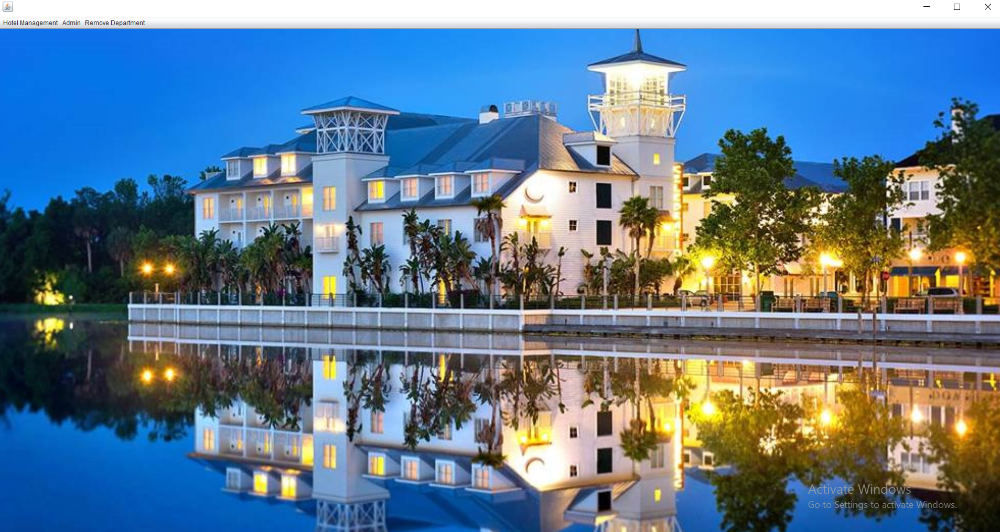
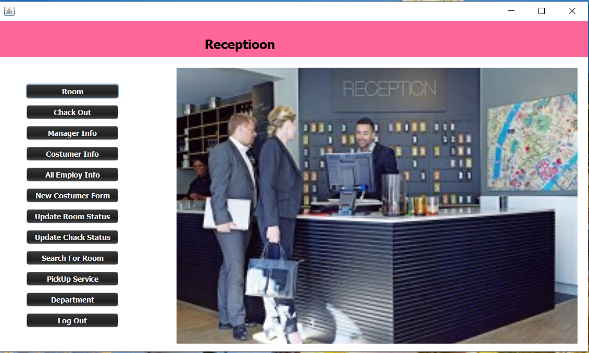
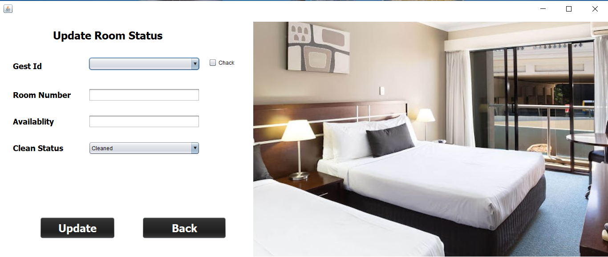
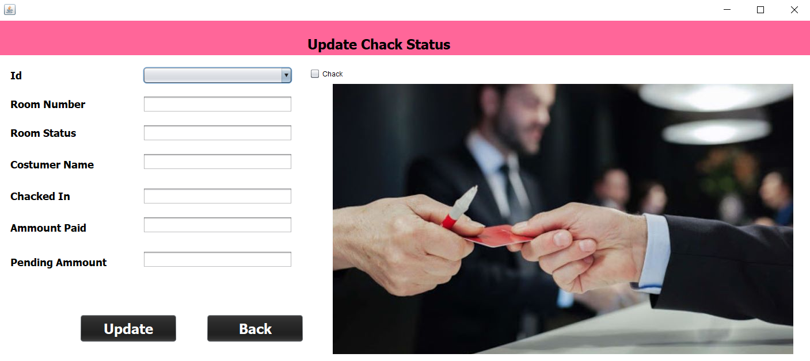
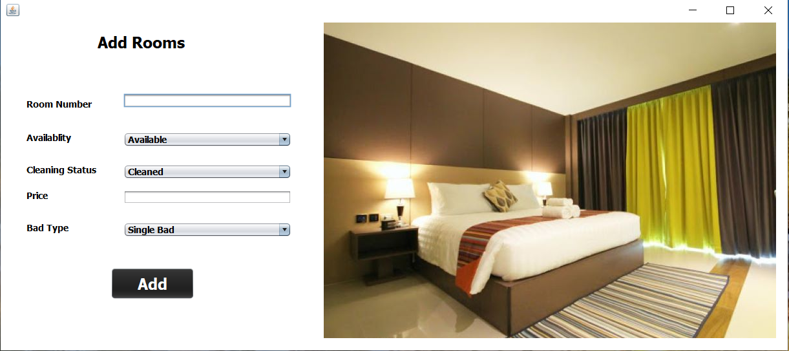
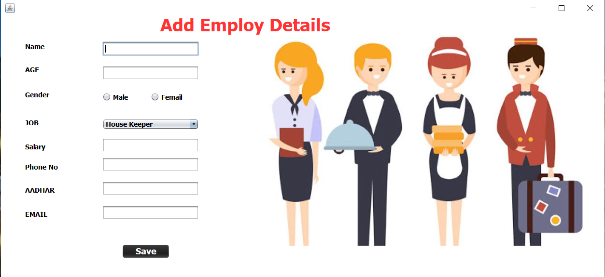
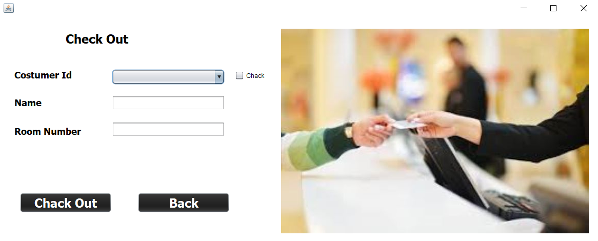

# HotelManagement_GUI_Application
# Front Page

 It is the front page in which there is a button by clicking on this button you will directly reach at the login page.

<h1>Login Page</h1>

Here is the login page in which you have to enter the admin password  
If the password and username will be correct then it will through you on the main page 

<h1>Main Page</h1>

Here is the main page of the project in which there are three menu item  1>-First is reception 2->Second is add employ 3->Third is remove employ 
 

<h1>Reception Page</h1>

Here is the reception page in which the admin can register the new constumer and can give hotel room on rent and all the work of the reception the admin can do here like:  1->Room Add
   2->Chack Out  3->Manager Information 4->Costumer Information
   5->All Employ Information
   6->Update Room Status
   7->Search For Room Availablity For Costumer
   8->Pick Up Services For Special Costumer
   9->Department Status 

<h1>Room Information</h1>

Here is the login page in which you have to enter the admin password  
If the password and username will be correct then it will through you on the main page 

Here is the login page in which you have to enter the admin password  
If the password and username will be correct then it will through you on the main page 

Here is the login page in which you have to enter the admin password  
If the password and username will be correct then it will through you on the main page 

Here is the login page in which you have to enter the admin password  
If the password and username will be correct then it will through you on the main page 

Here is the login page in which you have to enter the admin password  
If the password and username will be correct then it will through you on the main page 

Here is the login page in which you have to enter the admin password  
If the password and username will be correct then it will through you on the main page 

Here is the login page in which you have to enter the admin password  
If the password and username will be correct then it will through you on the main page 

Here is the login page in which you have to enter the admin password  
If the password and username will be correct then it will through you on the main page 

Here is the login page in which you have to enter the admin password  
If the password and username will be correct then it will through you on the main page 

