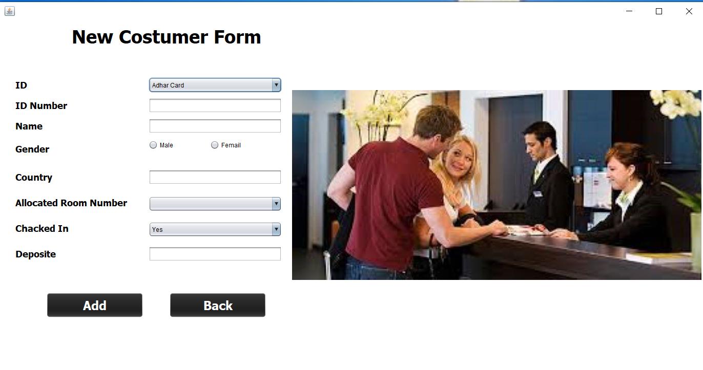

# HotelManagement_GUI_Application
# Front Page

 It is the front page in which there is a button by clicking on this button you will directly reach at the login page.

<h1>Login Page</h1>

Here is the login page in which you have to enter the admin password  
If the password and username will be correct then it will through you on the main page 

<h1>Main Page<.h1>

Here is the main page of the project in which there are three menu item  1>-First is reception 2->Second is add employ 3->Third is remove employ 
If the password and username will be correct then it will through you on the main page 

Here is the login page in which you have to enter the admin password  
If the password and username will be correct then it will through you on the main page 

Here is the login page in which you have to enter the admin password  
If the password and username will be correct then it will through you on the main page 

Here is the login page in which you have to enter the admin password  
If the password and username will be correct then it will through you on the main page 

Here is the login page in which you have to enter the admin password  
If the password and username will be correct then it will through you on the main page 

Here is the login page in which you have to enter the admin password  
If the password and username will be correct then it will through you on the main page 

Here is the login page in which you have to enter the admin password  
If the password and username will be correct then it will through you on the main page 

Here is the login page in which you have to enter the admin password  
If the password and username will be correct then it will through you on the main page 

Here is the login page in which you have to enter the admin password  
If the password and username will be correct then it will through you on the main page 

Here is the login page in which you have to enter the admin password  
If the password and username will be correct then it will through you on the main page 

Here is the login page in which you have to enter the admin password  
If the password and username will be correct then it will through you on the main page 

